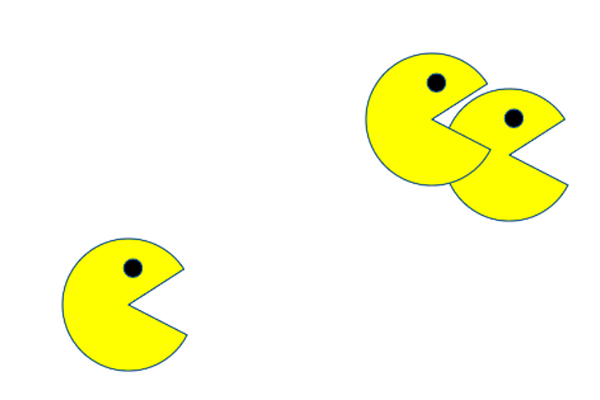

<div align="center" id="top"> 
  
</div>

<h1 align="center">PacMen Factory</h1>
<hr>

<p align="center">
  <a href="#dart-about">About</a> &#xa0; | &#xa0; 
  <a href="#sparkles-features">Features</a> &#xa0; | &#xa0;
  <a href="#rocket-technologies">Technologies</a> &#xa0; | &#xa0;
  <a href="#checkered_flag-starting">Installation</a> &#xa0; | &#xa0;
  <a href="#memo-license">License</a> &#xa0; | &#xa0;
  <a href="#recycle-improvements">Improvements</a> &#xa0; | &#xa0;	
  <a href="https://snando2020.github.io/" target="_blank">Author</a>
</p>

<br>

## :book: About ##

In this project the code was developed by creating a collision function that detects the edges of an area such as a div in which the image changes direction, the position of the image was worked on as well as the movement times.. 

## :sparkles: Features ##

:heavy_check_mark: Use setTimeout

:heavy_check_mark: Create function collisition

## :wrench: Technologies ##

The following tools were used in this project:

- Javascript 
- HTML
- CSS

## :checkered_flag: Installation ##

```bash
# Clone this project
$ git clone https://github.com/snando2020/PacMenFactory

# Access
$ cd PacMenFactory

# Just Open the index.html file on your browser

```

## :pencil2: Improvements ##

It would be nice the next improvements:
- [ ] Area of traslation inside de yellow square.
- [ ] Application conditional random for the change de direction with operator %.

## :memo: License ##

This project is under license from MIT.


Made by <a href="https://snando2020.github.io/" target="_blank">Saul F. Vega Montenegro</a>

&#xa0;

<a href="#top">Back to top</a>
